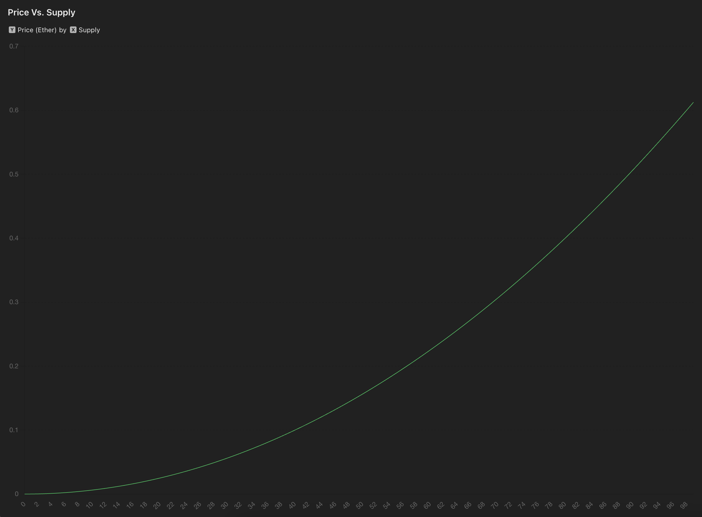

# Art.Tech Litepaper

## Introduction

Art.Tech is a platform that combines generative AI art creation with blockchain technology, creating an ecosystem for artists and collectors. By utilizing smart contracts on the Ethereum blockchain, Art.Tech provides an environment for creating, trading, and investing in digital art.

## Platform Overview

Art.Tech consists of two main components:

1. A frontend interface that enables users to create generative AI art.
2. A backend powered by smart contracts that manage the tokenization, trading, and reward distribution of digital artworks.

## Key Features

### 1. AI-Powered Art Creation

Artists can use generative AI tools to create digital artworks directly on the platform.

### 2. NFT Minting

Created artworks can be minted as ERC-1155 tokens, providing proof of ownership and enabling trading.

### 3. Dynamic Pricing Model

Art.Tech employs a bonding curve pricing model, adjusting the price of each artwork based on supply and demand.

### 4. Trading Mechanism

Users can buy and sell artworks directly on the platform, with all transactions recorded on the blockchain.

### 5. Artist Royalties

Artists receive a percentage of each sale, providing ongoing compensation for their creations.

### 6. Prize Pool System

A portion of each transaction contributes to a prize pool, which is distributed to top-performing artworks and their holders at the end of each round.

### 7. Ranking System

Artworks are ranked based on their trading volume, creating a competitive environment for artists and collectors.

## Key Terms and Concepts

### Mints
In Art.Tech, "mints" refer to the individual tokens of a specific artwork. When an artist mints an artwork, they create the first "mint." As the artwork is bought and traded, more mints can be created, increasing the supply. Each mint represents partial ownership of the artwork.

### Rounds
A "round" in Art.Tech is a competition period with a specific duration. Each round ends when the prize pool reaches a predetermined amount. During a round, artworks compete based on their trading volume. At the end of each round, prizes are distributed, and a new round begins.

### Bonding Curve
The bonding curve is a mathematical formula used to determine the price of mints. As more mints of an artwork are created (bought), the price increases. Conversely, as mints are burned (sold), the price decreases. This creates a dynamic pricing model responsive to supply and demand.

### Trading Volume
The trading volume for an artwork is the total value of all buy and sell transactions for that artwork's mints during a round. It's used to rank artworks and determine the winner of each round.

### Prize Pool
The prize pool is a collection of funds accumulated from a portion of each transaction fee. At the end of each round, this pool is distributed between the winning artist and the holders of the winning artwork's mints.

## Technical Architecture

Art.Tech is built on two main smart contracts:

1. **ArtTech Contract**: Manages the core functionality of the platform, including minting, buying, selling, and ranking of artworks.

2. **ArtTechPrizePool Contract**: Handles the distribution of prizes to winning artists and artwork holders.

## Token Economics

- **Minting Fee**: A fee is required to mint new artworks, aiming to prevent spam and maintain quality.
- **Trading Fees**: Each transaction includes fees that are distributed as follows:
  - The artist (royalties)
  - The prize pool
  - The protocol (for maintenance and development)
- **Community-Centric Distribution**: Notably, two-thirds of the trading fees are distributed back to the community through artist royalties and the prize pool, emphasizing the platform's focus on supporting creators and participants.
- **Prize Distribution**: When a round concludes, 50% of the prize goes to the winning artist, and 50% is distributed among the winning artwork's holders.

## Rounds and Competitions

Art.Tech operates in rounds, each ending when the prize pool reaches a predetermined amount. At the end of each round:

1. The artwork with the highest trading volume is declared the winner.
2. Prizes are distributed to the winning artist and artwork holders.
3. A new round begins, resetting trading volumes and rankings.

## Governance and Upgradability

The platform is managed by a designated owner who can:

- Adjust fee percentages
- Set the minting fee
- Modify the round prize amount
- Update the protocol fee address

This allows for future improvements and adaptations based on community feedback and market conditions.

## Security Measures

Art.Tech implements several security features:

- Reentrancy guards to prevent exploitation
- Access control to critical functions
- Checks to ensure proper fee distribution

## Conclusion

Art.Tech offers a blend of AI-powered creation and blockchain-based trading. The platform aims to provide a transparent and engaging environment for artists and collectors in the digital art space.
